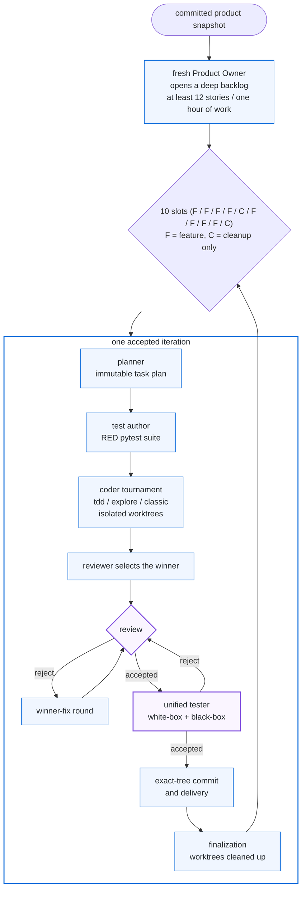

# Forge

Forge is a dependency-free local controller for continuous, Product Owner-led software delivery.
It turns a product brief into durable ten-iteration sprints, keeps product decisions inside agent
roles, and owns only execution, retries, persistence, contract checks, and safe Git delivery.

Forge does not declare a product finished. It keeps running sprints until an operator pauses or
cancels it, or until a concrete blocker puts the run in `stalled` or `failed` state.

## Sprint loop

<!-- forge:sprint-loop-diagram:begin -->

<!-- forge:sprint-loop-diagram:end -->

`F` is a feature iteration and `C` is cleanup-only. A slot advances only after the reviewer and
tester accept the same implementation fingerprint and Forge safely delivers it. Rejected work
returns to the winning coder's context, then passes through review again before any retest.

After ten accepted iterations Forge discards all role contexts and starts a fresh Product Owner
visit against the newly delivered product.

## Roles and gates

- **Product Owner** works from a disposable committed snapshot with inspection tools. It launches
  public workflows, may capture screenshots or other evidence, ignores internal code quality, and
  creates at least twelve stories representing at least one hour of work. The backlog must cover
  all eight feature slots and both cleanup slots, with reserve work left over.
- **Planner** selects the highest-priority ready story of the controller-required type and converts
  it into one immutable task plan. It must preserve every Product Owner acceptance criterion
  verbatim and provide bounded validation commands and public checks.
- **Test author** writes the black-box pytest suite before any code exists. Tests treat the product
  as a public CLI/API/process, cover the plan's public checks and acceptance criteria, and must
  fail on the current snapshot (RED). Forge watches the suite fail; a suite that passes immediately
  is sent back for correction. After three failed attempts the sprint continues with a recorded
  warning instead of stalling, and genuinely stuck expectations may ship as `xfail` with precise
  repair notes visible to every later role. An interruption after the final attempt replays the
  durable response and reclassifies the stored suite instead of dropping it.
- **Coders (tournament)** — three independent agents (`tdd`, `explore`, `classic`) implement the
  same immutable plan in isolated Git worktrees from the same base commit. They never see each
  other's work. The controller-owned test suite is copied into every worktree; modifying it
  disqualifies the candidate. Failed or limit-hit candidates stay as artifacts — including the
  patch of any dirty tree they left behind — and the tournament continues as long as one eligible
  candidate remains; edits recovered from an interrupted candidate are preserved the same way.
  A tournament whose every submitted candidate stayed disqualified is a deterministic dead end,
  not a recoverable stall.
- **Reviewer** first selects the tournament winner from the candidate patches, validation results,
  and clean-code quality, then gates winner-fix rounds. Serious correctness, completeness, security,
  regression, missing-test, and real cleanliness failures (lying names, 200-line functions, god
  objects) block. Taste and small polish issues become non-blocking nits for a later cleanup
  iteration. Borrow hints from losing candidates are prompt guidance for the winner, never
  auto-applied code.
- **Unified tester** combines white-box and black-box acceptance in a disposable copy. It receives
  the accepted review and mechanical validation, exercises every public check, and must provide
  task, white-box, and public evidence.

Coder and reviewer prompts carry Uncle Bob clean-code rules: names that say what the code does,
short functions, SOLID boundaries, no cleverness, no narrating comments.

Review and test reports must cover every planned task exactly once and name the exact prospective
Git tree fingerprint. Empty evidence, stale fingerprints, failed validation, skipped public checks,
or unresolved blockers cannot pass the controller contracts.

Cleanup iterations may map accumulated nits to explicit tasks. A nit is resolved only after that
cleanup plan passes the same review and test gates; nits never block a feature iteration.

## Durability and Git safety

Forge uses one implementation branch and worktree per candidate per iteration, all under
`forge/RUN_ID/`. It fingerprints the complete prospective tree, including staged, unstaged,
untracked, binary, executable-mode (100755), and already committed changes. Preparing the
delivery commit does not change that identity. Before delivery Forge verifies all of the following:

- reviewer and tester accepted the current tree of the winning candidate;
- the commit tree equals the accepted tree;
- the implementation is exactly one non-empty commit over its recorded base;
- the target checkout is clean and has not drifted;
- delivery is a fast-forward.

At finalization Forge deletes all three candidate worktrees and branches; every candidate's patch,
diffstat, and validation evidence stays in the run artifacts.

An OS-backed advisory lock in the canonical Git common directory gives one Forge process exclusive
ownership of the repository for the complete run or recovery call. A second CLI process, duplicate
web recovery request, or another run targeting the same repository fails before mutating run state,
worktrees, or refs.

Delivery is idempotent. Recovery reconciles crashes before commit recording, after commit creation,
after target integration, and during finalization without replaying an accepted iteration or making
a duplicate commit.

Every role transition is persisted. A process restart resumes Product Owner correction, planning,
test authoring, the tournament, selection, winner-fix, review, testing, delivery, or finalization
at its durable phase. Edits left by an interrupted coder are fingerprinted and reviewed instead of
being overwritten. A coder round with no tool calls and no workspace progress stalls immediately;
exhausted revision budgets, unavailable required stories, and external blockers stop as `stalled`
instead of creating an unbounded agent loop.

Validation commands that invoke an unexecutable `./script` are retried once through `bash` when the
file has a shebang; executable mode bits are otherwise preserved end to end in fingerprints,
snapshots, and delivery.

Runs written by older controllers (schema 1 and 2) remain visible as read-only artifacts and cannot
be resumed by this controller; start a new run instead.

## Requirements

- Linux or macOS, Git, and Python 3.12 or newer with `pytest` importable (Forge runs the black-box
  RED gate and candidate validation with its own interpreter).
- At least one authenticated supported agent CLI:
  - `codex` for the native Codex GPT-6 Sol and Luna models;
  - `claude` (Claude Code) for Claude Opus 5.5;
  - `opencode` for the OpenCode Go GLM 5.3 Flash model.
- A clean target Git repository. Forge can initialize an unborn selected branch. Push-enabled runs
  also require an `origin` remote.

Forge uses existing CLI authentication, has no runtime Python dependencies, and does not require
API keys in its configuration.

## Model policy

Forge routes every role through a closed model policy that mirrors
`~/.hermes/scripts/model_policy.py`. The active catalog is exactly four models, each pinned to one
harness and one reasoning effort:

| Selector | Central policy id | Harness | Effort |
| --- | --- | --- | --- |
| `codex:gpt-6-sol:medium` | `openai-codex/gpt-6-sol` | native Codex | medium |
| `codex:gpt-6-luna:xhigh` | `openai-codex/gpt-6-luna` | native Codex | xhigh |
| `claude:claude-opus-5-5:medium` | `claude-code/claude-opus-5-5` | Claude Code | medium |
| `opencode:opencode-go/glm-5.3-flash:xhigh` | `opencode-go/glm-5.3-flash` | OpenCode Go | xhigh |

A selector without an effort is pinned to the policy effort; any other effort is rejected. Opus is
addressed by its explicit `claude-opus-5-5` slug, never the `opus` alias. The retired roster
(GPT-5.6 Sol/Terra/Luna, DeepSeek, MiMo) and Grok, Kimi, Qwen, OpenRouter, the stale Alibaba/Z.AI
providers, and local models are never part of active routing. Legacy identities still *parse* so old
run state and old UI preferences stay readable, but they are rejected for a new run, for recovery,
and at the agent runner, and are never selected as a fallback.

The central policy module (`/home/jan/.hermes/scripts/model_policy.py`, or the path in
`FORGE_CENTRAL_POLICY_SCRIPT`) is the source of truth: every policy load asks its
`validate_model(id, harness)` which roster models it allows right now, and selection pools, the
swarm's cheap pool (GLM Flash plus three Luna slots), resume restaffing and the agent runner all
drop anything it refuses. A missing or broken central module allows nothing. A harness wrapper that
exits 78 (the central gate refused the model) is a non-retryable policy refusal.

The cheap swarm never destroys unmerged work: a dropped, conflicted or losing candidate worktree that
holds anything over its base (untracked files included) stays in place, listed under `preserved` in
`swarm/state.json`, and a retried pair gets fresh worktree and branch names.

The promotion state in `/home/jan/.hermes/state/model-policy.json` (or the path in `--policy-path` /
`FORGE_MODEL_POLICY_PATH`) is still recorded in the run snapshot, but it no longer changes which
models are eligible.

New runs draw their roster with the central policy weights:

- brain and planner: Sol 50 / GLM 50;
- coder tactics: Opus 25 / Luna 50 / GLM 25, preferring distinct models;
- test author and tester: Opus 20 / Luna 55 / GLM 25;
- reviewer: Sol 50 / GLM 50.

The review gate switches to a reviewer from a different family than the winning coder (GLM for a GPT
winner, Sol for a GLM winner) if one is healthy, and records a diversity exception when none is.
Failover after a quota or provider failure draws only from the four policy models at their pinned
effort, prefers another family, and never returns to a disabled model. Explicit CLI/UI role overrides
remain available but every override must pass the same policy gate.

Saved runs written under an older policy recover only after an explicit migration
(`forge resume --migrate-models`, or `migrate_models: true` in the UI recovery payload); Forge never
silently runs a banned model. The selected roster and the promotion snapshot are persisted in the run
config and state without secrets.

## Run the control room

```bash
python3 -m forge ui
```

Or install it in a virtual environment:

```bash
python3 -m venv .venv
.venv/bin/pip install -e .
.venv/bin/forge ui
```

The UI listens on `127.0.0.1:8787` by default. It configures the repository, branch, brief, the
policy-selected roster, a coder pool for the tournament, an optional failover model, and push
behavior. Closing the browser does not stop a run. Pause, resume, cancel, and same-run recovery are
available from the run detail view.

External reviewer or tester blockers may be retried in place after the external condition changes.
Deterministic stalls such as exhausted revision limits, repeated no-progress rounds, a missing
required story, or a tournament where every submitted candidate stayed disqualified are
intentionally not recoverable in place; change the product input or start a new run rather than
repeating the same bounded phase.

The three coder tactics draw their models from the configurable coder pool, weighted by role and
preferring distinct families. With fewer than three distinct pool entries, models are reused; with
more, three are drawn. Weighted coder reshuffling is enabled by default and redraws the pool before
each sprint (`--no-shuffle-coders` disables it). A single surviving eligible candidate still
completes an iteration — the tournament degrades, it never silently becomes the design.

### Feedback during a run

The run detail view accepts clarifications and scope-change notes while Forge is working. Each note
has a durable ID, status, explanation, and delivery history. Forge records it immediately, then adds
it to the next matching agent prompt at a safe invocation boundary. A prompt already running is left
alone. If a clarification arrives during the parallel coder tournament, Forge holds it for the
reviewer so candidate work does not receive inconsistent input. The append-free conversation
snapshot is written atomically to `.forge/runs/RUN_ID/conversation.json`, independently from the
controller's run-state checkpoint, and is reloaded after recovery.

Use the CLI when the control room is not open:

```bash
python3 -m forge feedback add --repo /path/to/product --run-id RUN_ID \
  --message "Keep the existing error response shape." --target-role reviewer
python3 -m forge feedback list --repo /path/to/product --run-id RUN_ID
python3 -m forge feedback decide --repo /path/to/product --run-id RUN_ID \
  --feedback-id FEEDBACK_ID --action schedule_replan
```

`--kind scope_change` places a note in `needs_decision`. The control room or `feedback decide`
can schedule an approved replan for the next Product Owner boundary; the active iteration and the
rest of the current sprint keep their existing plans. Clarifications move through `received`, `pending`, and `applied`. A
deferred or rejected item remains in history, and duplicate request IDs or repeated open messages do
not create duplicate records.

Reviewers and testers can publish structured suggestions, questions, and blockers with the stage
context, rationale, and expected impact. Non-blocking suggestions do not gate delivery. Accepting a
suggestion or answering a question records a message through the same feedback queue. Scope changes
still wait for a separate decision, and feedback never pauses, cancels, restarts, merges, or deploys a
run. Repeated suggestion titles are deduplicated across the run, and the panel keeps at most 20 open
suggestions; excess suggestions are counted and held back.

The control-room API supports `GET /api/runs/RUN_ID/feedback`,
`POST /api/runs/RUN_ID/feedback`, `POST /api/runs/RUN_ID/feedback/FEEDBACK_ID/decision`,
`GET /api/runs/RUN_ID/suggestions`, and `POST /api/runs/RUN_ID/suggestions/SUGGESTION_ID`.

## Command-line run

Unspecified role flags are drawn from the active model policy; explicit flags override the draw but
must pass the same policy gate:

```bash
python3 -m forge run \
  --repo /path/to/product \
  --brief /path/to/brief.md \
  --branch main \
  --brain codex:gpt-6-sol:medium \
  --planner codex:gpt-6-sol:medium \
  --test-author codex:gpt-6-luna:xhigh \
  --coder-tdd codex:gpt-6-luna:xhigh \
  --coder-explore opencode:opencode-go/glm-5.3-flash:xhigh \
  --coder-classic claude:claude-opus-5-5:medium \
  --reviewer opencode:opencode-go/glm-5.3-flash:xhigh \
  --tester codex:gpt-6-luna:xhigh
```

Add `--no-shuffle-coders` to keep the initial coder draw for every sprint.

Use `--no-push` to deliver only to the local branch. Recover an interrupted run in place:

```bash
python3 -m forge resume --repo /path/to/product --run-id RUN_ID
```

`forge recover` is a compatibility alias that reloads the same durable run artifacts. Foreground
commands exit with status `0` after an operator pause or cancellation and `1` after `failed` or
`stalled`; continuous runs otherwise keep executing.

Selectors use `provider:model[:effort]`. The control room exposes only the closed active catalog
(Codex GPT-6 Sol/Luna, Claude Code Opus 5.5, and OpenCode Go GLM 5.3 Flash). Before the first sprint Forge
probes each unique model once. A usage-limit failure moves a role to another healthy active model
(never a disabled or retired one) without changing the sprint contract.

Recover an off-policy run by explicitly migrating it first:

```bash
python3 -m forge resume --repo /path/to/product --run-id RUN_ID --migrate-models
```

## Artifacts

Durable evidence lives under `TARGET_REPO/.forge/runs/RUN_ID/`:

```text
state.json
config.json
brief.md
events.jsonl
usage.jsonl
product-owner/visit-001/{attempt-*,decision.json,evidence/}
backlog/revision-001.json
sprints/001/summary.json
sprints/001/iterations/01/
  plan.json
  planner/attempt-*
  test-author/{attempt-*,red-attempt-*.json,suite.json}
  blackbox-tests/ (controller-owned suite copied into every candidate)
  candidates/{tdd,explore,classic}/round-1.{json,patch}
  selection/{attempt-*,selection.json}
  coder/round-*.{json,patch}
  review/round-*.json
  tester/round-*.json
  tester/evidence-round-*-*/
  delivery-intent.json
  delivery.json
  acceptance.json
```

Disposable snapshots and worktrees live in the user state directory, outside the target checkout.
Forge adds only local exclusions to `.git/info/exclude`; it does not modify the product's
`.gitignore`.

## Development

```bash
python3 -m pytest
python3 -m compileall -q forge
```

The Sprint loop diagram above is generated from the controller phases, not drawn by hand.
After changing iteration phases in `forge/orchestrator.py` or the schedule in
`forge/sprint.py`, refresh it with:

```bash
python3 -m forge.diagram --update README.md
python3 -m forge.diagram --check README.md  # exits 1 when the README is stale
```

`tests/test_diagram.py` fails when the README and the controller phases drift apart.

The tests use deterministic fake agents and real temporary Git repositories. They cover the fixed
sprint schedule, role gates, the RED test-author gate and its soft-stall policy, tournament
isolation and winner selection, candidate disqualification on test tampering, executable-mode
preservation, correction loops, evidence contracts, no-progress stalls, context reset,
complete-tree fingerprints, and recovery across agent and delivery crash windows without consuming
model tokens.
